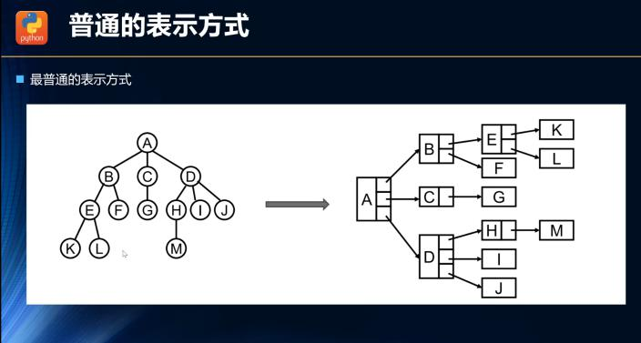
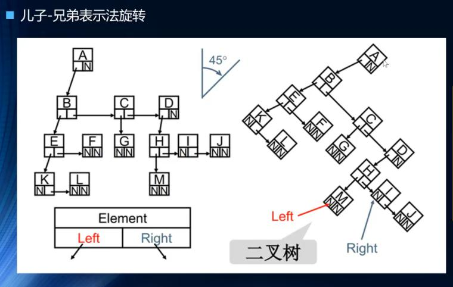

## 树结构的抽象
+ 公司组织架构表
+ 文件夹目录

## 树结构的优点
树结构相对于数组、链表和哈希表有哪些优点呢?

### 1. 数组结构(查询快，但是插入和删除慢)
优点：
+ 基于数字索引查询的效率高
缺点：
+ 基于元素查询时，需要先将数组进行排序，然后使用二分查找法才可以快速的查找
+ 头部和中间插入以及删除元素都需要引起大量的位移，效率很低 
### 2. 链表结构(查询慢，但是插入和删除快)
优点：
+ 链表进行插入和删除只是相邻节点指针的变化，效率高
缺点：
+ 查询一个元素需要从头依次遍历整个链表，效率低
### 3. 散列表结构(增删查快，但是空间利用率不高)
优点：
+ 哈希表的插入、删除和查询都很快，这是因为可以直接通过数字索引来找到指定的节点
缺点：
+ 哈希表的内存利用率不高，某些单元是没有被完全利用的
+ 哈希表中的元素是无序的，不能按照一种特定的顺序如从小到大进行遍历
+ 哈希表中无法快速的确定最大值或者最小值这些特殊的值

### 4. 树结构
树结构综合了以上数据结构的优点，同时弥补了以上数据结构的缺点，并且在抽象模拟某些生活中的场景的时候比如文件目录，树结构这种非线性结构可以表达一对多的关系。

## 树结构的术语
1. 树Tree：n个节点构成的有限集合，注意n是大于等于0的。当n=0的时候，叫做空树；当n>0的时候，表明是一个非空树，任何一个非空树都有一个根节点r表示。
2. 父节点Parent /子节点Child/兄弟节点Sibling
3. 叶子节点Leaf
4. 节点的度Degree：一个节点的直接子节点个数
5. 树的度：树的所有节点中最大的度就是整颗树的度
6. 节点层次Level：根节点的层次是1，其他任何节点的层次是其父节点的层数+1
7. 树的深度Depth：树中所有节点中的最大层次是这颗树的深度

## 树的表示方式
1. 普通表示

2. 儿子兄弟表示法
3. 二叉树

所有树都可以使用二叉树模拟出来，二叉树是及其重要的。

## 二叉树的概念
1. 二叉树的定义
二叉树：每一个节点最多可以分为两个叉，每一个节点有一个left 节点和一个right节点，绝大多数树结构都是一个二叉树，二叉树和链表一样，是一种动态数据结构。

2. 二叉树的特点
+ 每一颗二叉树都具有唯一跟节点
+ 每一个节点指向左边的称作左孩子，指向右边的成为右孩子
+ 二叉树中的每一个节点最多只能有两个子节点，并且每一个节点最多只能有一个父节点
+ 如果一个节点没有任何一个子节点，那么这个节点就被称作叶子节点。
+ 二叉树的节点并不一定会有两个孩子节点，还可能只有一个左节点或者只有一个右节点，还可能没有节点(叶子节点)
+ 二叉树中只有一个节点没有父节点，那就是根节点
+ 一个节点也可以是二叉树，代表左右两侧都没有子节点；更加特殊的来说空节点也是一颗二叉树。

3. 天然递归
+ 二叉树具有天然的递归结构，和链表的区别在于链表是线性的

4. 其他特点
+ 每一个节点的左节点也是一个二叉树，我们称之为左子树，这个左节点就是整颗左子树的根节点，同理右节点也是一颗二叉树。
+ 满二叉树：代表一颗二叉树上面除了叶子节点之外所有节点都有两个节点
+ 完全二叉树：除了二叉树最后一层外，其他各层的节点都是满的，并且最后一层的叶子节点只能从左到右连续存在，只可以缺少若干节点。

## 二叉树的特性
1. 第i层的最大节点数量
二叉树的第i层的最大节点数量为：2^(i-1)，当然i是大于等于1的。根节点的层数是1，其他节点的层数是其父节点层数+1

2. 深度为k的二叉树上所有节点的最大数量
深度为k的二叉树的最大节点数量为：2^k -1。

3. 对于任何非空二叉树，如果这颗树上的叶子节点个数为x，度为2的节点个数为y，那么满足条件x = y + 1 

## 二叉搜索树(BST)

### 特点
+ 对于二分搜索树来说，首先它是一颗二叉树
+ 特点1：每一个二分搜索树的节点的值都大于其左子树上每一个节点的值，并且需要小于其右子树上每一个节点的值。
+ 特点2：每一个二分搜索树的子树(左子树和右子树)也满足二分搜索树的条件
+ 特点3：每一个二分搜索树的节点存储的元素必须得具有可比较性，而在链表和数组中存储数据是没有这个要求的。这可以理解为即是二分搜索树的缺点也可以是优点，缺点是存储的元素必须得可被比较，优点就是可被比较的元素可以大大提高搜索查询的效率。
+ 特点4：二叉搜索树中相对较小的值一定在左节点上，相对较大的值一定在右节点上。

### 最大用途：快速的查找
为什么要这样设计二分搜索树？都是为了让查询更加高效。比如我们要在一颗二分搜索树中查询值为100的节点，此时：
1. 先看根节点是大于100还是小于100
2. 如果大于100，根据二分搜索树的特点任一节点的值都大于左子树上每一个节点的值，那么这个值为100的节点一定在根节点的左子树上
3. 如果小于100，根据二分搜索树的特点任一节点的值都小于右子树上每一个节点的值，那么这个值为100的节点一定在根节点的右子树上
这样就大大减少的查询和时间，提高了搜索查询的效率

其实这就是二分查找的思想，查找所需的最大次数就是等于二叉搜索树的深度。maxTimes = depth。
当插入的时候，其实也是一样的道理，一层层的通过二分查找的方法找到要查找的位置，然后将节点插入。

### 前驱节点和后继节点
如果我们删除二叉树中的某个节点，该节点既有左子树又有右子树，那么此时就需要从该节点的所有子节点中找到一个节点来替换当前这个要删除的节点，有一个特殊的规律就是这个替换的节点一定是和当前要删除的节点值最接近的那个节点，那么如何寻找这个最接近的节点：
1. 寻找稍微大一点点的节点，也就是前驱节点，规律告诉我们这个节点一定是当前要删除节点的右子树上的最小值节点；
2. 寻找稍微小一点点的节点，也就是后继节点，规律告诉我们这个节点一定是当前要删除节点的左子树上的最大值节点

如何寻找前驱节点？
先找到当前节点的右子树，然后一直找这个右子树上的最左侧的节点，如果左侧没有节点，那么这个右子树根节点就是前驱节点

如何寻找后继节点？
先找到当前节点的左子树，然后一直找这个左子树上的最右侧的节点，如果右侧没有节点，那么这个左子树根节点就是后继节点

## 平衡二叉树

二叉搜索树的优点：
1. 查找效率很高
2. 二叉搜索树的插入和查找节点的时间复杂度是O(logN),N是树节点的数量，也就是和树的深度有关

二叉搜索树的缺点：
1. 如果我们插入的数据是连续的，就会导致二叉搜索树左右分步不均匀，也就是不平衡树，对于一颗不平衡的树来说，相当于编写了一个链表，链表的查找是线性查找，此时查找效率变成了O(N)

由于操作一颗平衡二叉树的效率要远远高于一颗非平衡二叉树的效率，所以我们在插入的节点的时候尽可能的保证树是平衡的，怎么衡量呢？大体来说就是树上的每一个节点的左子树的总节点大致等于每一个节点的右子树上的总节点个数。下面是我们常见的两种平衡二叉树：

1. AVL树
AVL树是最早的一种平衡树，它的时间复杂度也是O(logN),删除和插入整体效率不如红黑树的。

2. 红黑树
红黑树是一种用的最多的二叉平衡树，时间复杂度同上，但是插入和删除操作的性能要好于AVL树。